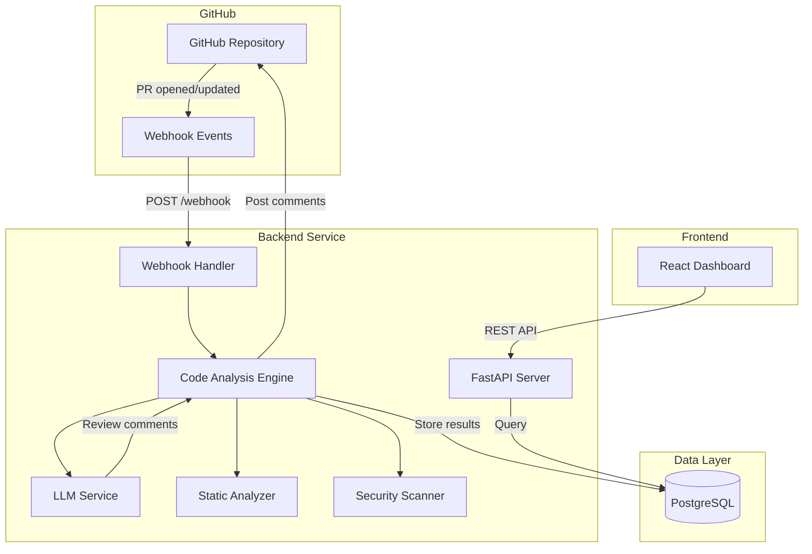

# AI Code Review Assistant — Implementation Plan

An AI-powered system that automatically analyzes GitHub pull requests and provides intelligent feedback (bug detection, security issues, performance suggestions, code quality). Built with FastAPI, React, PostgreSQL, LLM APIs, and Docker.

## System Architecture

---

## Proposed Changes

### Project Root

#### [NEW] [.env.example](file:///c:/Users/itsav/Downloads/Code%20Review/.env.example)
Environment variable template for GitHub token, LLM API keys, DB connection, and app config.

---

### Backend — FastAPI (`backend/`)

#### [NEW] [requirements.txt](file:///c:/Users/itsav/Downloads/Code%20Review/backend/requirements.txt)
Python dependencies: `fastapi`, `uvicorn`, `sqlalchemy`, `asyncpg`, `httpx`, `openai`, `python-dotenv`, `pydantic`, `alembic`, `bandit`, `radon`.

#### [NEW] [main.py](file:///c:/Users/itsav/Downloads/Code%20Review/backend/main.py)
FastAPI app entry point with CORS middleware, router mounting, lifespan events (DB init).

#### [NEW] [config.py](file:///c:/Users/itsav/Downloads/Code%20Review/backend/config.py)
Pydantic `Settings` class loading from environment (GitHub token, LLM API key, DB URL, etc).

#### [NEW] [database.py](file:///c:/Users/itsav/Downloads/Code%20Review/backend/database.py)
SQLAlchemy async engine, session factory, and `Base` declarative base.

#### [NEW] [models.py](file:///c:/Users/itsav/Downloads/Code%20Review/backend/models.py)
SQLAlchemy ORM models:
- `Repository` — repo name, owner, GitHub URL
- `PullRequest` — PR number, title, author, state, repo FK
- `ReviewResult` — analysis summary, quality score, PR FK
- `ReviewComment` — file, line, severity, category, issue, explanation, suggested fix
- `SecurityIssue` — vulnerability type, severity, file, description, remediation
- `CodeMetrics` — complexity, duplication %, lines of code, maintainability index

#### [NEW] [schemas.py](file:///c:/Users/itsav/Downloads/Code%20Review/backend/schemas.py)
Pydantic request/response schemas for all API endpoints.

#### [NEW] [routers/analysis.py](file:///c:/Users/itsav/Downloads/Code%20Review/backend/routers/analysis.py)
- `POST /api/analyze-pr` — Accepts `{repo_owner, repo_name, pr_number}`, triggers full analysis pipeline, returns review results.
- `GET /api/review-results` — List all reviews with filters (repo, date range, severity).
- `GET /api/review-results/{id}` — Get detailed review with all comments.

#### [NEW] [routers/insights.py](file:///c:/Users/itsav/Downloads/Code%20Review/backend/routers/insights.py)
- `GET /api/repository-insights/{owner}/{repo}` — Aggregated code quality metrics, trends.
- `GET /api/security-issues` — List security issues with filters.

#### [NEW] [routers/webhooks.py](file:///c:/Users/itsav/Downloads/Code%20Review/backend/routers/webhooks.py)
- `POST /api/webhook/github` — Receives GitHub webhook payloads, validates signature, auto-triggers analysis on `pull_request` opened/synchronize events.

#### [NEW] [services/github_service.py](file:///c:/Users/itsav/Downloads/Code%20Review/backend/services/github_service.py)
GitHub API integration using `httpx`:
- Fetch PR details, changed files, file contents
- Post review comments back to the PR
- Validate webhook signatures

#### [NEW] [services/llm_service.py](file:///c:/Users/itsav/Downloads/Code%20Review/backend/services/llm_service.py)
LLM integration with support for OpenAI/Claude/Gemini:
- Prompt engineering with structured system/user prompts
- Code change analysis (bug detection, security, performance, style)
- Structured JSON output parsing
- Explainability: each issue includes why it's problematic and how to fix it

#### [NEW] [services/analysis_engine.py](file:///c:/Users/itsav/Downloads/Code%20Review/backend/services/analysis_engine.py)
Orchestrates the full analysis pipeline:
1. Fetch PR diff from GitHub
2. Run static analysis (complexity via `radon`, security via `bandit`-like rules)
3. Run LLM analysis on each changed file
4. Aggregate results, compute quality score
5. Store in database
6. Post comments to GitHub

#### [NEW] [services/static_analyzer.py](file:///c:/Users/itsav/Downloads/Code%20Review/backend/services/static_analyzer.py)
Static analysis utilities:
- Code complexity (cyclomatic complexity via `radon`)
- Duplicate code detection (simple hash-based)
- Code style pattern checks
- Lines of code metrics

#### [NEW] [services/security_scanner.py](file:///c:/Users/itsav/Downloads/Code%20Review/backend/services/security_scanner.py)
Security vulnerability detection:
- SQL injection patterns
- XSS patterns
- Hardcoded secrets/credentials
- Insecure function usage
- Dependency vulnerability hints

---

### Frontend — React Dashboard (`frontend/`)

#### [NEW] [package.json](file:///c:/Users/itsav/Downloads/Code%20Review/frontend/package.json)
Vite + React project with dependencies: `react-router-dom`, `recharts`, `axios`, `lucide-react`.

#### [NEW] [src/App.jsx](file:///c:/Users/itsav/Downloads/Code%20Review/frontend/src/App.jsx)
Root component with routing: Dashboard, Reviews, Security, Insights pages.

#### [NEW] [src/index.css](file:///c:/Users/itsav/Downloads/Code%20Review/frontend/src/index.css)
Design system: dark theme, CSS variables, typography (Inter font), glassmorphism cards, animations.

#### [NEW] [src/pages/Dashboard.jsx](file:///c:/Users/itsav/Downloads/Code%20Review/frontend/src/pages/Dashboard.jsx)
Overview page: summary statistics cards (reviews, issues, security alerts), recent reviews list, code quality trend chart.

#### [NEW] [src/pages/Reviews.jsx](file:///c:/Users/itsav/Downloads/Code%20Review/frontend/src/pages/Reviews.jsx)
Review results page: list of PR analyses with severity badges, expandable review comments with explanations and suggested fixes.

#### [NEW] [src/pages/Security.jsx](file:///c:/Users/itsav/Downloads/Code%20Review/frontend/src/pages/Security.jsx)
Security alerts page: vulnerability list with severity, category charts, remediation suggestions.

#### [NEW] [src/pages/Insights.jsx](file:///c:/Users/itsav/Downloads/Code%20Review/frontend/src/pages/Insights.jsx)
Repository insights: code quality score gauge, complexity trends, duplication metrics, maintainability charts.

#### [NEW] [src/components/Sidebar.jsx](file:///c:/Users/itsav/Downloads/Code%20Review/frontend/src/components/Sidebar.jsx)
Navigation sidebar with icons, active state, and branding.

#### [NEW] [src/components/StatCard.jsx](file:///c:/Users/itsav/Downloads/Code%20Review/frontend/src/components/StatCard.jsx)
Reusable metric card with icon, value, trend indicator.

#### [NEW] [src/components/ReviewCard.jsx](file:///c:/Users/itsav/Downloads/Code%20Review/frontend/src/components/ReviewCard.jsx)
Expandable review card showing issue, explanation, and suggested fix.

#### [NEW] [src/services/api.js](file:///c:/Users/itsav/Downloads/Code%20Review/frontend/src/services/api.js)
Axios API client configured for backend endpoints.

---

### Docker & Deployment

#### [NEW] [backend/Dockerfile](file:///c:/Users/itsav/Downloads/Code%20Review/backend/Dockerfile)
Python 3.11 slim image, multi-stage build, runs uvicorn.

#### [NEW] [frontend/Dockerfile](file:///c:/Users/itsav/Downloads/Code%20Review/frontend/Dockerfile)
Node 20 build stage + nginx serve stage.

#### [NEW] [docker-compose.yml](file:///c:/Users/itsav/Downloads/Code%20Review/docker-compose.yml)
Three services: `backend` (port 8000), `frontend` (port 3000), `db` (PostgreSQL, port 5432). Volumes for DB persistence.

#### [NEW] [nginx.conf](file:///c:/Users/itsav/Downloads/Code%20Review/nginx.conf)
Nginx config for serving React SPA with API proxy to backend.

---

### Documentation

#### [NEW] [README.md](file:///c:/Users/itsav/Downloads/Code%20Review/README.md)
Professional README:
- Architecture diagram (Mermaid)
- Feature overview
- Tech stack
- Setup instructions (local + Docker)
- API documentation
- System design explanation
- Deployment guide

---

## Verification Plan

### Automated Tests
1. **Backend startup**: `cd backend && pip install -r requirements.txt && python -c "from main import app; print('OK')"`
2. **Docker build**: `docker-compose build` — all three services build without errors
3. **Docker run**: `docker-compose up -d` — services start and health checks pass

### Browser Verification
1. Navigate to `http://localhost:5173` (dev) or `http://localhost:3000` (Docker) — dashboard loads with styled UI
2. Verify sidebar navigation works across all pages
3. Verify charts and visualizations render correctly

### Manual Verification
1. **User tests the GitHub webhook** by configuring it on a test repo and opening a PR
2. **User verifies LLM analysis** by providing API keys and triggering `POST /api/analyze-pr`
3. **User reviews the README** for completeness and clarity
